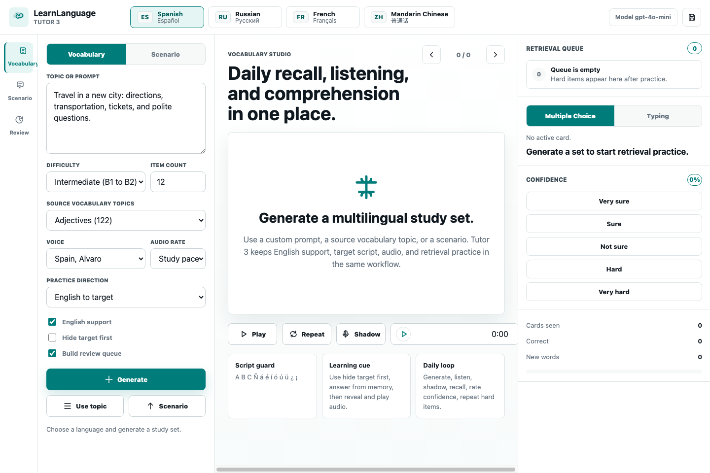

# LearnLanguage

LearnLanguage is a local AI language-learning workspace for vocabulary practice, scenario comprehension, active recall, and target-language audio. The project now supports Spanish, Russian, French, and Mandarin Chinese across the maintained tutor applications.

The recommended interface is **Tutor 3**, a local browser app that integrates the previous vocabulary and scenario workflows into one modern learning environment.

## Current Applications

| App | Interface | Status | Purpose |
| --- | --- | --- | --- |
| Tutor 3 | Local web app | Recommended | Integrated vocabulary, scenarios, audio, retrieval practice, confidence scoring, and session save |
| Tutor 1 | Tkinter desktop app | Legacy maintained | Vocabulary generation, source-topic vocabulary, tests, and audio |
| Tutor 2 | Tkinter desktop app | Legacy maintained | Scenario generation, aligned English support, multiple-choice comprehension, and audio |

## Supported Languages

| Language | Script | LLM generation | Topic vocabulary | TTS |
| --- | --- | --- | --- | --- |
| Spanish | Latin with accents | Yes | Source data | Edge-TTS Spanish voices |
| Russian | Cyrillic | Yes | Generated and cached | Edge-TTS Russian voices |
| French | Latin with accents | Yes | Generated and cached | Edge-TTS French voices |
| Mandarin Chinese | Simplified Chinese | Yes | Generated and cached | Edge-TTS Mandarin voices |

## Tutor 3

Tutor 3 combines the strongest pieces of Tutor 1 and Tutor 2 into a single local web app:

- Vocabulary Studio for custom concept generation and source-topic vocabulary.
- Scenario Lab for short information-dense passages with aligned English support.
- Multiple-choice and typing retrieval practice.
- Confidence rating and a hard-item review queue.
- Target-language audio with Edge-TTS and browser playback.
- Script-aware rendering for accents, Cyrillic, and Simplified Chinese.
- Local runtime cache for generated audio, topic translations, and saved sessions.
- OpenAI-powered generation with safe offline demo fallback when no API key is configured.



### Run Tutor 3

```bash
cd tutors/tutor3
python app.py --host 127.0.0.1 --port 8765 --open
```

Then open:

```text
http://127.0.0.1:8765
```

Use the language buttons at the top to switch between Spanish, Russian, French, and Mandarin Chinese. Use **Generate** for custom AI vocabulary, **Use topic** for the source vocabulary library, and **Scenario** for comprehension practice.

## Setup

Install dependencies from the repository root:

```bash
python -m pip install -r requirements.txt
```

Create a local `.env` file in the repository root:

```text
OPENAI_API_KEY="your_api_key_here"
```

Optional model override:

```text
LEARNLANGUAGE_MODEL="gpt-4o-mini"
```

Do not commit `.env`, API keys, generated audio, runtime caches, IDE metadata, or local test results. The repository `.gitignore` excludes those files.

## Legacy Desktop Tutors

Tutor 1 remains available for the original Tkinter vocabulary workflow:

```bash
cd tutors/tutor1
python tutor1.py
```

Tutor 2 remains available for the original Tkinter scenario workflow:

```bash
cd tutors/tutor2
python tutor2.py
```


## Directory Structure

```text
LearnLanguage/
├── README.md
├── requirements.txt
├── docs/
│   └── images/
│       ├── tutor1-interface.png
│       ├── tutor2-interface.png
│       └── tutor3-interface.png
├── tutors/
│   ├── tutor1/
│   │   ├── tutor1.py
│   │   ├── class_tutor.py
│   │   └── data/
│   │       └── vocabulary_es.json
│   ├── tutor2/
│   │   ├── tutor2.py
│   │   └── scenarios_out/
│   └── tutor3/
│       ├── app.py
│       ├── backend/
│       ├── static/
│       └── runtime/
└── other/
```

`tutors/tutor3/runtime/` is local-only and ignored. It stores generated audio, topic-translation caches, and saved session files.

## Validation

Recommended checks:

```bash
python -m py_compile tutors/tutor1/tutor1.py tutors/tutor1/class_tutor.py tutors/tutor2/tutor2.py tutors/tutor3/app.py tutors/tutor3/backend/*.py
python tutors/tutor1/count_vocabs.py
cd tutors/tutor3 && python app.py --host 127.0.0.1 --port 8765
```

Manual UI checks:

- Tutor 3 opens at `http://127.0.0.1:8765`.
- Spanish, Russian, French, and Mandarin Chinese language controls are visible.
- Source-topic vocabulary loads and builds the retrieval queue.
- OpenAI vocabulary generation returns aligned English and target-language text.
- Scenario generation returns a passage, five questions, English mirrors, and explanations.
- Edge-TTS returns MP3 audio for all four target languages.
- Browser audio playback either starts or shows a clear ready state if the browser blocks immediate playback.
- Desktop and mobile layouts render without clipped primary controls.

## Security

- API keys are read from environment variables only.
- `.env` files are ignored and must stay local.
- Runtime audio, caches, and session files are ignored.
- The README and source files avoid hard-coded local machine paths.
- Before publishing, run a secret and path scan over the files being committed.

## Development Status

The project is moving toward Tutor 3 as the primary full-stack local learning app while Tutor 1 and Tutor 2 remain available for legacy workflows and regression comparison.

Ongoing project.
