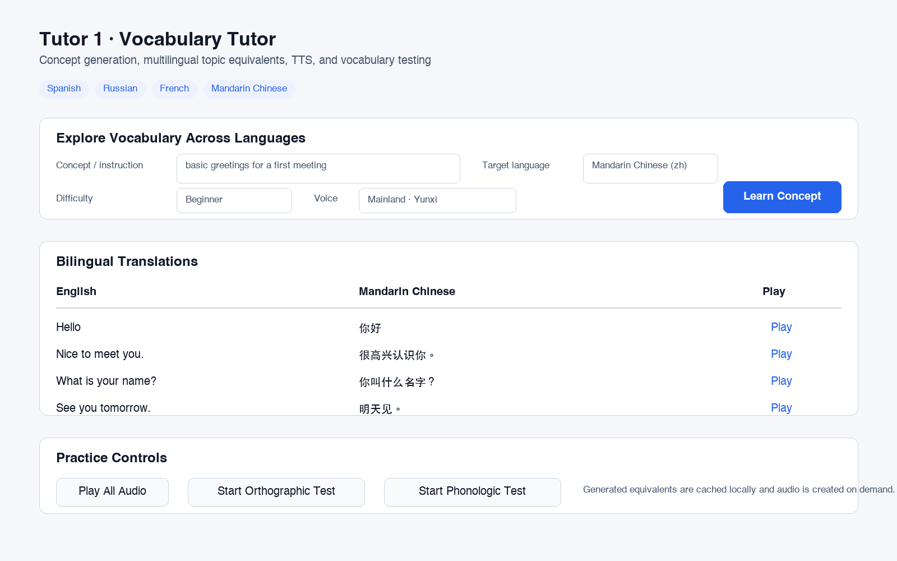
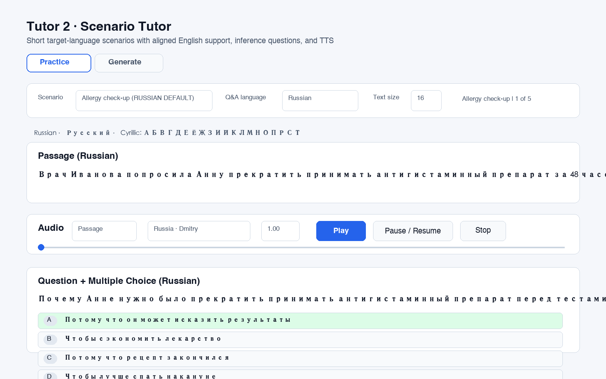

# LearnLanguage

LearnLanguage is a Python-based language learning workspace focused on practical vocabulary practice, AI-generated learning material, and audio-supported comprehension training. The current tutor applications support Spanish, Russian, French, and Mandarin Chinese, with English used as the source or explanation language.

## Project Scope

The repository contains two active tutor applications:

- **Tutor 1: Vocabulary Tutor**  
  A Tkinter vocabulary trainer for English-to-target-language study. It supports concept-based generation, source vocabulary topics, multiple-choice testing, and target-language audio playback.

- **Tutor 2: Scenario Tutor**  
  A Tkinter comprehension trainer that generates short information-dense scenarios, aligned English translations, multiple-choice inference questions, explanations, and target-language TTS playback.

Both tutors are designed for local desktop use and require an OpenAI API key for AI-generated content.

## Supported Languages

| Language | Script | Tutor 1 | Tutor 2 | TTS |
| --- | --- | --- | --- | --- |
| Spanish | Latin with accents | Yes | Yes | Edge-TTS Spanish voices |
| Russian | Cyrillic | Yes | Yes | Edge-TTS Russian voices |
| French | Latin with accents | Yes | Yes | Edge-TTS French voices |
| Mandarin Chinese | Simplified Chinese | Yes | Yes | Edge-TTS Mandarin voices |

## Directory Structure

```text
LearnLanguage/
├── README.md
├── requirements.txt
├── content/
│   └── TENSES/
├── other/
│   └── obsolete/
└── tutors/
    ├── tutor1/
    │   ├── tutor1.py
    │   ├── class_tutor.py
    │   ├── class_scroll.py
    │   ├── data/
    │   │   └── vocabulary_es.json
    │   ├── audio/
    │   │   └── spanish/
    │   └── test_results/
    └── tutor2/
        ├── tutor2.py
        ├── scenarios_out/
        └── group_rules_attached.json
```

Generated audio, local result files, virtual environments, IDE metadata, and secret files are intentionally excluded from version control.

## Setup

Create or activate a Python environment, then install the project dependencies:

```bash
python -m pip install -r requirements.txt
```

Create a local `.env` file in the project root and define an `OPENAI_API_KEY` value there.

Do not commit `.env` or any file containing API keys. The repository `.gitignore` excludes `.env`, virtual environments, generated audio, local test reports, IDE metadata, and OS metadata.

## Running Tutor 1

Tutor 1 is the vocabulary tutor.

```bash
cd tutors/tutor1
python tutor1.py
```

Core capabilities:

- Generate vocabulary lists from a custom concept prompt.
- Select Spanish source vocabulary topics from `data/vocabulary_es.json`.
- Generate equivalent topic vocabulary for Russian, French, and Mandarin Chinese on demand.
- Cache generated equivalents locally for repeat use.
- Play individual or sequential target-language audio.
- Run orthographic and audio-based tests.

## Running Tutor 2

Tutor 2 is the scenario comprehension tutor.

```bash
cd tutors/tutor2
python tutor2.py
```

Core capabilities:

- Generate short scenarios in Spanish, Russian, French, or Mandarin Chinese.
- Keep aligned English translations for comprehension support.
- Generate five inference-oriented multiple-choice questions per scenario.
- Switch Q&A display between the target language and English.
- Play target-language passage, question, and answer-option audio.

## Screenshots

Tutor 1 (Vocabulary Tutor):



Tutor 2 (Scenario Tutor):



## Data Model

Tutor 1 uses a source vocabulary library:

```text
tutors/tutor1/data/vocabulary_es.json
```

The source file stores English and Spanish topic entries. For Russian, French, and Mandarin Chinese, Tutor 1 generates target-language equivalents from the English source terms and stores them in a local cache:

```text
tutors/tutor1/data/vocabulary_multilingual_cache.json
```

That cache is generated data and is excluded from version control by default. Regenerating it is safe because it contains vocabulary equivalents, not secrets.

Tutor 2 scenario bundles are UTF-8 JSON files and preserve non-Latin scripts with `ensure_ascii=False`.

## Security Notes

- API keys are loaded only from environment variables.
- `.env` is ignored and must stay local.
- The README and source code avoid hard-coded local machine paths.
- Generated audio and test results are local runtime artifacts.
- Before publishing, run a secret/path scan and inspect any staged files.

## Validation

Recommended local checks:

```bash
python -m py_compile tutors/tutor1/tutor1.py tutors/tutor1/class_tutor.py tutors/tutor2/tutor2.py
python tutors/tutor1/count_vocabs.py
python tutors/tutor2/tutor2.py --no-gui
```

For GUI validation, launch each tutor and confirm:

- The window opens without errors.
- Each supported target language can be selected.
- LLM generation returns target-language text plus English support fields.
- TTS creates and plays target-language audio.
- Non-Latin scripts render correctly.

## Development Status

This repository is actively evolving toward a broader multilingual language-learning toolkit with stronger reusable data models, richer practice flows, and cleaner generated asset management.

Ongoing project.
