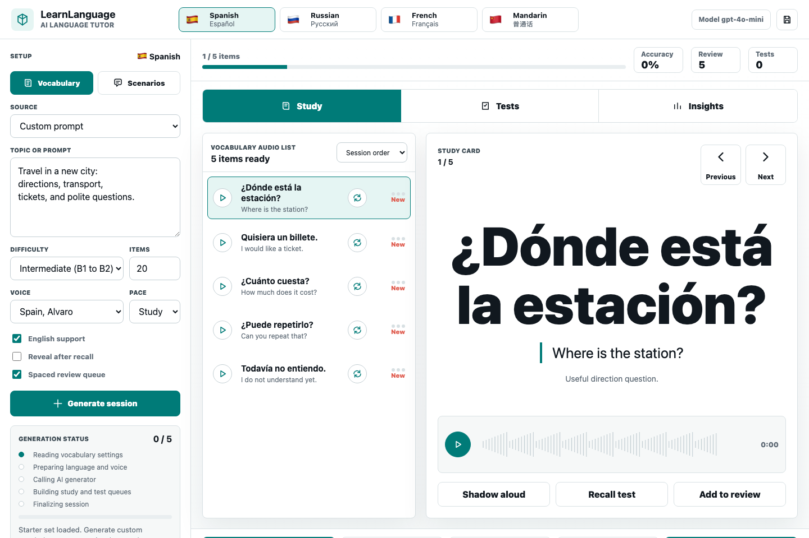

# LearnLanguage

LearnLanguage is a local AI language tutor for vocabulary acquisition, scenario comprehension, active recall, and target-language audio. It supports Spanish, Russian, French, and Mandarin Chinese with script-aware rendering, modern browser-based study controls, and maintained legacy desktop tutors.

The recommended experience is the integrated local web tutor in `tutors/tutor3`. The folder name is retained for repository compatibility, while the product UI is branded simply as LearnLanguage.



## What It Does

- Generates bilingual vocabulary from custom prompts with OpenAI structured output.
- Loads source-topic vocabulary from the curated vocabulary library.
- Translates topic vocabulary into Russian, French, and Mandarin Chinese with caching.
- Generates short scenario passages with aligned English support, questions, choices, answers, and explanations.
- Plays target-language audio with Edge-TTS voices for every supported language.
- Provides per-item audio controls, play-all review, and a real decoded waveform display in the browser.
- Separates Study, Tests, and Insights so retrieval practice does not distract from focused learning.
- Includes orthographic recall, dictation, sound discrimination, and scenario comprehension tests.
- Tracks accuracy, review load, weak items, orthography score, phonemic score, and session attempts.
- Keeps runtime audio, translation caches, and saved sessions local.

## Applications

| Application | Path | Interface | Status | Purpose |
| --- | --- | --- | --- | --- |
| Integrated web tutor | `tutors/tutor3` | Local browser app | Recommended | Vocabulary, scenarios, audio, tests, insights, and saved sessions |
| Vocabulary desktop tutor | `tutors/tutor1` | Tkinter desktop app | Legacy maintained | Original vocabulary workflow, source topics, orthographic tests, phonologic audio tests |
| Scenario desktop tutor | `tutors/tutor2` | Tkinter desktop app | Legacy maintained | Original scenario workflow, aligned English support, MCQ comprehension, audio player |

## Supported Languages

| Language | Script | Vocabulary generation | Topic vocabulary | Audio |
| --- | --- | --- | --- | --- |
| Spanish | Latin with accents | Yes | Source Spanish data | Spanish Edge-TTS voices |
| Russian | Cyrillic | Yes | Generated and cached | Russian Edge-TTS voices |
| French | Latin with accents | Yes | Generated and cached | French Edge-TTS voices |
| Mandarin Chinese | Simplified Chinese | Yes | Generated and cached | Mandarin Edge-TTS voices |

## Learning Workflow

1. Choose a language from the flag switcher.
2. Select Vocabulary or Scenarios in the setup panel.
3. Use a custom prompt or a source vocabulary topic.
4. Pick difficulty, item count, voice, pace, and study support options.
5. Generate a session.
6. Study with the focused card, arrow buttons, keyboard navigation, and per-item audio.
7. Move to Tests for spelling, dictation, sound discrimination, or scenario comprehension.
8. Check Insights for accuracy, weak items, and recommended next practice.

## Run The Web Tutor

Install dependencies from the repository root:

```bash
python -m pip install -r requirements.txt
```

Create a local `.env` file in the repository root:

```text
OPENAI_API_KEY="your_api_key_here"
```

Optional model override:

```text
LEARNLANGUAGE_MODEL="gpt-4o-mini"
```

Start the local web app:

```bash
cd tutors/tutor3
python app.py --host 127.0.0.1 --port 8765 --open
```

Then open:

```text
http://127.0.0.1:8765
```

If OpenAI is unavailable or a request times out, LearnLanguage keeps the interface usable with built-in demo content and labels the source as offline demo content.

## Run Legacy Tutors

Vocabulary desktop tutor:

```bash
cd tutors/tutor1
python tutor1.py
```

Scenario desktop tutor:

```bash
cd tutors/tutor2
python tutor2.py
```


## Directory Structure

```text
LearnLanguage/
├── README.md
├── requirements.txt
├── docs/
│   └── images/
│       ├── learnlanguage-interface.png
│       ├── tutor1-interface.png
│       └── tutor2-interface.png
├── tutors/
│   ├── tutor1/
│   │   ├── tutor1.py
│   │   ├── class_tutor.py
│   │   └── data/
│   │       └── vocabulary_es.json
│   ├── tutor2/
│   │   ├── tutor2.py
│   │   └── scenarios_out/
│   └── tutor3/
│       ├── app.py
│       ├── backend/
│       ├── static/
│       └── runtime/
└── other/
```

`tutors/tutor3/runtime/` is local-only and ignored. It stores generated audio, topic-translation caches, and saved session files.

## Validation

Recommended checks:

```bash
python -m py_compile tutors/tutor1/tutor1.py tutors/tutor1/class_tutor.py tutors/tutor2/tutor2.py tutors/tutor3/app.py tutors/tutor3/backend/*.py
python tutors/tutor1/count_vocabs.py
cd tutors/tutor3 && python app.py --host 127.0.0.1 --port 8765
```

Manual UI checks:

- The web tutor opens at `http://127.0.0.1:8765`.
- Spanish, Russian, French, and Mandarin Chinese flags and labels are visible.
- Switching languages restores that language's own session or loads the matching starter set.
- Source-topic vocabulary loads and builds the review queue.
- OpenAI vocabulary generation returns aligned English and target-language text.
- Scenario generation returns a passage, questions, choices, answers, and explanations.
- Orthographic recall, dictation, sound discrimination, and scenario comprehension tests are separate from the Study view.
- Edge-TTS returns MP3 audio for all four target languages.
- Browser audio playback starts or shows a clear ready state if autoplay is blocked.
- Desktop and mobile layouts render without clipped primary controls.

## Security

- API keys are read from environment variables only.
- `.env` files are ignored and must stay local.
- Runtime audio, caches, and session files are ignored.
- Source files and documentation avoid hard-coded local machine paths.
- Before publishing, run a secret and path scan over the files being committed.

## Development Status

LearnLanguage is moving toward the integrated local web tutor as the primary learning environment while the two legacy desktop tutors remain available for regression comparison and specialized workflows.

Ongoing project.
