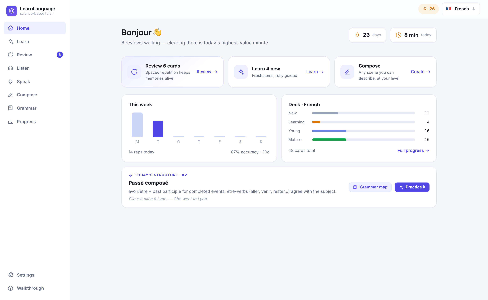
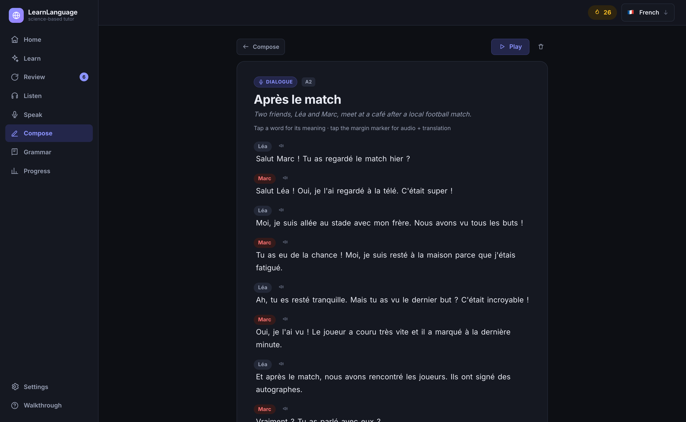
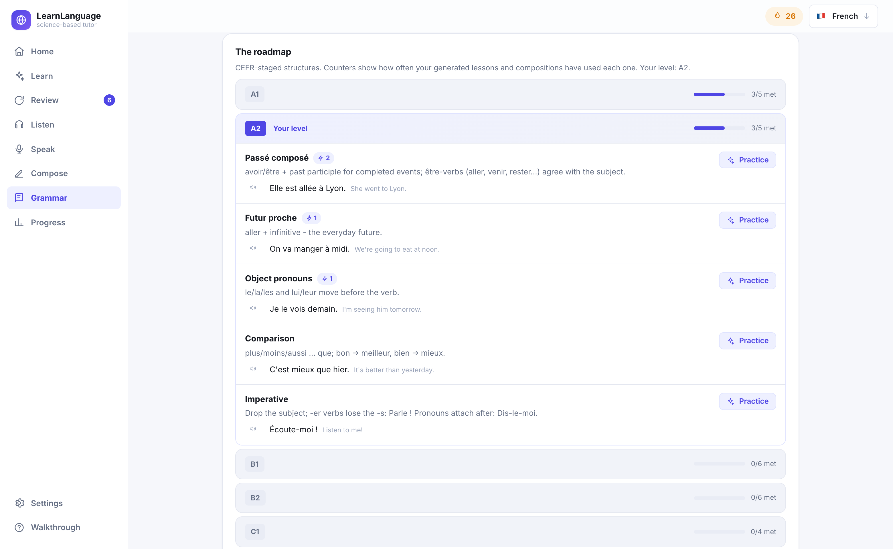

# LearnLanguage

[](https://github.com/stvsever/LearnLanguage)
[](LICENSE)
[](https://openrouter.ai/models)
[](Dockerfile)

**A local-first, science-based language tutor that runs on your machine.** 🧠

Spaced repetition, active recall, listening, speaking, free-form composed input, and an explicit grammar map: one continuous learning loop, with all progress stored privately in your browser.

Built for 🇫🇷 **French** (default), 🇪🇸 **Spanish**, 🇷🇺 **Russian**, and 🇨🇳 **Mandarin**. The interface is in English.



## 🚀 Quickstart

```bash
git clone https://github.com/stvsever/LearnLanguage.git
cd LearnLanguage
python -m venv .venv && source .venv/bin/activate
pip install -r requirements.txt
python app.py --open
```

The app opens at `http://127.0.0.1:8765`. A first-run walkthrough shows you around, and the app itself guides you through connecting a free [OpenRouter](https://openrouter.ai/keys) key: paste it once in the interface and it saves automatically, no restart needed.

Without a key the app runs fully offline on curated French starter content. With a key it generates unlimited lessons, compositions, and word glosses in all four languages. Audio always works: free neural voices with a browser fallback.

🐳 Prefer Docker?

```bash
docker build -t learnlanguage .
docker run -p 8765:8765 learnlanguage
```

## 🔁 How you learn with it

A session follows one loop, and the dashboard always points at the next step:

1. **Review** clears the cards the scheduler predicts you are about to forget.
2. **Learn** introduces new vocabulary through a guided ladder: see and hear the item in context, recognize its meaning, then type it from memory.
3. **Compose, Listen, or Speak** turns knowledge into skill with real input and output.

Ten focused minutes a day beats a weekend marathon; the streak and heatmap keep you honest. 🔥

## 🗂️ The rooms

| Room | What happens there |
| --- | --- |
| 🏠 **Home** | The single best next action, streak, weekly activity, deck pipeline, and a rotating "today's structure" nudge |
| ✨ **Learn** | LLM-generated lessons on any topic at your CEFR level, each item with IPA or pinyin, neural audio, an example sentence, and a usage note |
| 🔄 **Review** | The FSRS spaced-repetition queue with four-grade rating, real interval previews, and exercises that get harder as memories get stronger |
| 🎧 **Listen** | Dictation and sound-discrimination drills built from your own deck |
| 🎙️ **Speak** | Pronunciation practice scored word by word with free on-device speech recognition |
| ✍️ **Compose** | Describe anything; one model call picks the best format and writes it at your level (see below) |
| 📖 **Grammar** | The structural map of your language: pillars, a CEFR roadmap, transfer traps, phonology |
| 📈 **Progress** | Vocabulary growth, live memory strength, grammar coverage, study mix, consistency, leeches |

## ✍️ Compose: describe it, get it

Type any idea: a scene, a rant, a voicemail, a news piece. A single LLM call classifies the best presentation format (dialogue, monologue, story, or article) and writes it at your level, deliberately weaving in the grammar structures you are currently learning. While it works, the interface shows every underlying step, from format classification to validation.



Every composition arrives with per-segment audio (dialogues get a distinct neural voice per speaker), tap-any-word contextual glosses, aligned translations, grammar spotlights (verbatim excerpts showing your target structures in action), and comprehension questions. One tap adds any word to your spaced-repetition deck. Pieces are saved to a local library, because rereading familiar input is some of the highest-value practice there is.

## 📖 Grammar as a first-class object

Each language ships a structured model of what there is to learn and in what order, grounded in its typology: six pillars (the mental model), a CEFR-staged roadmap of about thirty features with playable examples, the classic traps for English speakers, and the sound system.



This one model does three jobs:

1. **Steers generation.** Lessons and compositions receive a grammar brief: which structures you own, which to target. Input lands just above your level by construction.
2. **Is the reference.** The Grammar view renders the whole map, and every feature has a one-tap "Practice" that pre-fills Compose.
3. **Tracks coverage.** Generated content reports which features it actually used; Progress shows how much of each level you have genuinely met.

The four models in brief: French (fusional Romance: gender and agreement, the verb engine, clitic pronouns, liaison), Spanish (pro-drop, ser/estar, two past aspects, the living subjunctive), Russian (six cases, aspect pairs, motion verbs, word order as information structure), Mandarin (tones, topic-prominence, aspect particles, measure words, complements).

## 🧠 The learning science inside

| Principle | Implementation |
| --- | --- |
| Spaced repetition | An FSRS scheduler models every card's memory state and times reviews to a configurable target retention (default 90%) |
| Active recall | Every exposure is a test; the modality escalates with card maturity: recognition, typed production, listening transcription, cloze in context |
| Rich encoding | New items pair orthography, pronunciation, audio, and context, then get retrieved twice within the first minute |
| Comprehensible input | Compositions are written from a brief of exactly what you know, plus a thin layer of inferable new material |
| Output and noticing | Speaking practice surfaces the gap between what you meant to say and what a recognizer heard |
| Nuanced feedback | Diacritic-aware verdicts, typo tolerance, and character-level diffs at the moment of error |
| Consolidation | Daily streaks, sane default limits, and a consistency heatmap, because memories consolidate during sleep |

## 🏗️ Architecture

```text
app.py                  # zero-framework HTTP server (Python stdlib) + JSON API
backend/
├── config.py           # env, paths, provider selection, in-app key setup
├── languages.py        # language profiles: voices, scripts, recognition locales
├── grammar.py          # per-language grammar model -> prompts + UI + progress
├── llm.py              # provider chain, schema-validated JSON generation with
│                       #   repair retry, reasoning-mode handling, model override
├── content.py          # lessons, format-classified compositions, glosses
├── models.py           # pydantic schemas; all LLM output is validated
├── tts.py              # neural text-to-speech with a content-addressed disk cache
└── seed/               # curated French starter deck + composition (offline mode)
static/
├── css/                # design system: tokens, components, views (light + dark)
└── js/
    ├── srs.js          # FSRS scheduler
    ├── grading.js      # normalization, edit distance, diffs, verdicts
    ├── store.js        # localStorage state, migrations, grammar tracking
    ├── audio.js        # TTS client, per-speaker voices, Web Speech fallback
    ├── keysetup.js     # in-app OpenRouter key onboarding (paste, auto-save)
    └── views/          # home, learn, review, listen, speak,
                        #   compose, grammar, progress, settings
tests/                  # Python unit tests + Node tests for the JS engines
```

Design decisions:

- **No build step.** The frontend is native ES modules: open the app, edit a file, refresh.
- **Local-first.** All learner data lives in `localStorage`, exportable as JSON from Settings. The server only generates content and audio.
- **LLM-agnostic.** [OpenRouter](https://openrouter.ai) first (default model `deepseek/deepseek-v4-flash-0731`, switchable in Settings to a curated list or any custom slug), OpenAI as fallback, curated seed content offline. Every response is validated against pydantic schemas with one repair retry.
- **Free TTS.** Microsoft Edge neural voices via `edge-tts`, cached on disk, with the browser's Web Speech API as an offline fallback.
- **Honest feedback.** Long-running generation shows its underlying steps; every settings change confirms itself with a visible save indicator.

## ⚙️ Configuration

The easiest path is in-app: **Settings → AI model** connects your OpenRouter key (it saves to the local `.env` automatically) and lets you pick any model. Environment variables for advanced setups:

| Variable | Default | Purpose |
| --- | --- | --- |
| `OPENROUTER_API_KEY` | none | Enables lesson, composition, and gloss generation |
| `LEARNLANGUAGE_MODEL` | `deepseek/deepseek-v4-flash-0731` | Server-default model; users can override in Settings |
| `OPENAI_API_KEY` | none | Fallback provider when no OpenRouter key is set |
| `LEARNLANGUAGE_OPENAI_MODEL` | `gpt-4o-mini` | Model for the OpenAI fallback |
| `LEARNLANGUAGE_DEFAULT_LANGUAGE` | `fr` | Language preselected on first run |
| `LEARNLANGUAGE_LLM_TIMEOUT` | `120` | Per-request LLM timeout in seconds |

## 🧪 Tests

```bash
# Backend: grammar model integrity, schemas, seeds, key setup (no network)
python -m unittest discover -s tests -v

# Frontend engines: FSRS scheduler + grading (Node 20 or newer)
node --test tests/frontend.test.mjs
```

## 🔒 Privacy

- Your API key is stored only in the local `.env` on your machine; `.env` is gitignored.
- Learner data never leaves your machine except for the text sent to the LLM and TTS providers you configure.
- Generated audio and caches live in `runtime/`, which is gitignored.

## 📄 License

MIT, see [LICENSE](LICENSE).
